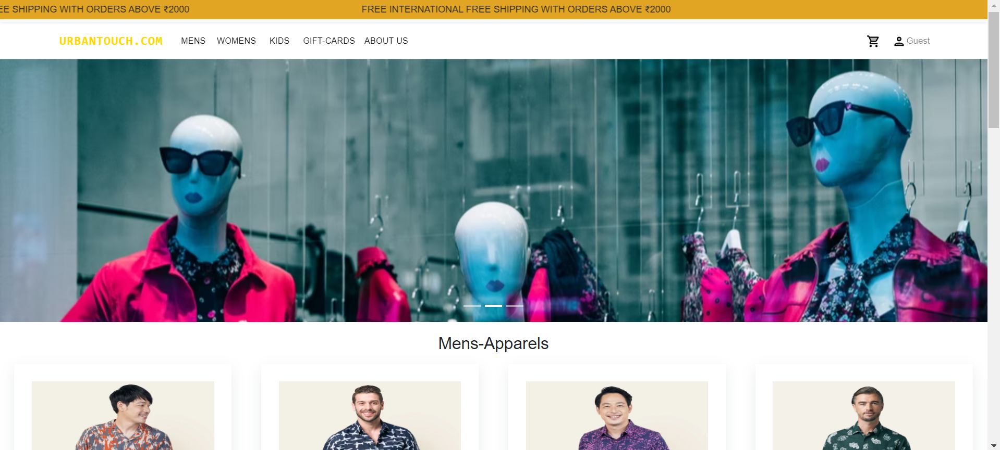

# urban_touch.com_frontend
An e-commerce web site which deals with different types of cloth related products and Gifts products .

<h2>Teck Stack:</h2>

 <h3>A. Front-End</h3>
<li>1. React JS</li>
<li>2. Material UI</li>
<li>3. Bootsrap </li>

 <h3>A. Front-End</h3>
 <li>1. Node JS</li>
 <li>1. Express</li>
 <li>1. MongoDB</li>
 
 <h2>Features:</h2>
 
  <li>Search</li>
  <li>filter and sorting</li>
  <li>Add to cart</li>
  <li>Login/Signup authentication</li>
  <li>Responsive</li>

<!--    -->
# Some Screen Shorts:
<h2>Home Page</h2>

<h2>Signup Page</h2>

<h2>Login Page</h2>

<h2>Product Page</h2>

<h2>Product Details Page</h2>

<h2>Cart Page</h2>

<h2>Checkout page</h2>

<h2>Payment Page</h2>

